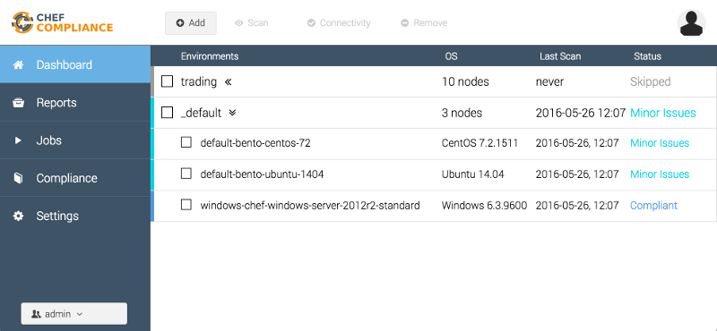
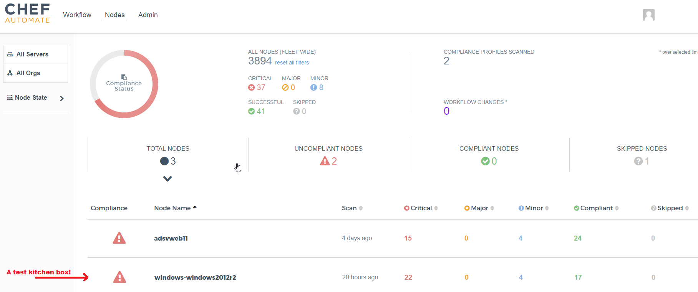

# Example: Test-Kitchen with Chef Compliance

This example demonstrates the usage of the audit cookbook with test-kitchen. In order to use it, we expect to have `COMPLIANCE_API` and `COMPLIANCE_ACCESSTOKEN` available as environment variables.

```
export COMPLIANCE_API='https://compliance.test/api/'
export COMPLIANCE_ACCESSTOKEN='eyJh..GTA'
```

If you want to use the refresh token, use the following settings:

```
export COMPLIANCE_API='https://compliance.test/api'
export COMPLIANCE_REFRESHTOKEN='40/YUP...mA==''
```

For Windows devs, you can set these environment variables in PowerShell (recommended over user/system variables):
```
$env:COMPLIANCE_API = "https://compliance.test/api/"
$env:COMPLIANCE_ACCESSTOKEN = "eyJh..GTA"
$env:COMPLIANCE_REFRESHTOKEN = "11/z..=="
```

## Converge Linux

```

$ KITCHEN_YAML=.kitchen.linux.yml kitchen list
Instance                   Driver   Provisioner  Verifier  Transport  Last Action
default-bento-centos-72    Vagrant  ChefZero     Inspec    Ssh        <Not Created>
default-bento-ubuntu-1404  Vagrant  ChefZero     Inspec    Ssh        <Not Created>

$ KITCHEN_YAML=.kitchen.linux.yml kitchen converge
-----> Starting Kitchen (v1.8.0)
-----> Converging <default-bento-centos-72>...

...

-----> Converging <default-bento-ubuntu-1404>

...

-----> Kitchen is finished. (0m35.94s)

# destroy the instances
$ KITCHEN_YAML=.kitchen.linux.yml kitchen destroy
```

## Converge Windows

```
$ KITCHEN_YAML=.kitchen.win.yml kitchen list
Instance                Driver   Provisioner  Verifier  Transport  Last Action
windows-windows-2012r2  Vagrant  ChefZero     Inspec    Winrm      <Not Created>

$ KITCHEN_YAML=.kitchen.win.yml kitchen kitchen converge
-----> Starting Kitchen (v1.8.0)
-----> Converging <windows-2012r2>

...

-----> Kitchen is finished. (0m35.94s)


# destroy the instances
$ KITCHEN_YAML=.kitchen.win.yml kitchen destroy

```


Now, the node reports are available in Chef Compliance:



If, configured, the reports are now in Chef Automate instead:


